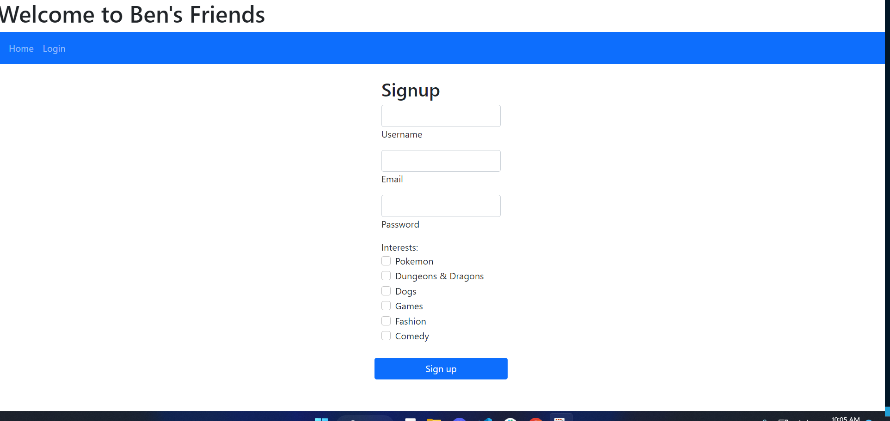

# bens-friends

## Description

An e-commerce website to purchase interesting collectables and share your collection with 
others.  The simple and clean homepage showcases featured users and their collections.  The 
application has an intuitive search function.

USER STORY:

As a fan of collectables, I want have the ability to purchase, share, and provide feedback on my collection so that others can appreciate my collection.

## Table Of Contents

- [Credits](#credits)
- [Installation](#installation)
- [Link](#link)
- [License](#license)

## Credits

https://github.com/EricKim86

https://github.com/RyanMBelcher

https://github.com/dpinkus87

## Installation

To use the app/website, follow our public link below and browse the categories and items. To make a purchase or share a collection, please sign up with a free user account. 

## Link

Repo: 
https://github.com/EricKim86/bens-friends.git

Website:
TBD

## License

MIT License

Copyright (c) [2022-2023] [Ben's Friends, Inc.]

Permission is hereby granted, free of charge, to any person obtaining
a copy of this software and associated documentation files (the
"Software"), to deal in the Software without restriction, including
without limitation the rights to use, copy, modify, merge, publish,
distribute, sublicense, and/or sell copies of the Software, and to
permit persons to whom the Software is furnished to do so, subject to
the following conditions:

The above copyright notice and this permission notice shall be
included in all copies or substantial portions of the Software.

THE SOFTWARE IS PROVIDED "AS IS", WITHOUT WARRANTY OF ANY KIND,
EXPRESS OR IMPLIED, INCLUDING BUT NOT LIMITED TO THE WARRANTIES OF
MERCHANTABILITY, FITNESS FOR A PARTICULAR PURPOSE AND
NONINFRINGEMENT. IN NO EVENT SHALL THE AUTHORS OR COPYRIGHT HOLDERS BE
LIABLE FOR ANY CLAIM, DAMAGES OR OTHER LIABILITY, WHETHER IN AN ACTION
OF CONTRACT, TORT OR OTHERWISE, ARISING FROM, OUT OF OR IN CONNECTION
WITH THE SOFTWARE OR THE USE OR OTHER DEALINGS IN THE SOFTWARE.
